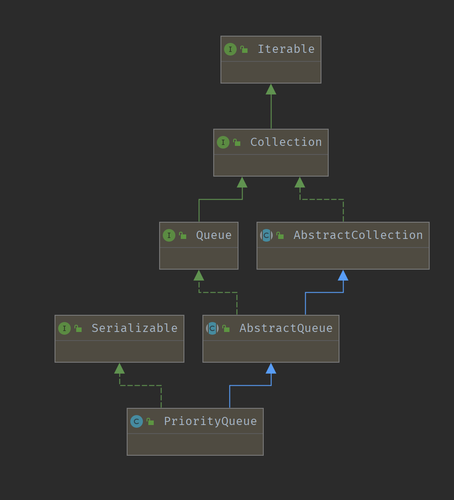

学习笔记
=======

## Deque

1. Queue
2. Dequeue 和 Stack对比

|Stack|Deque|
|-----| -----|
|push(e)|addFirst(e)|
|pop()|removeFirst()|
|peek()| peekFirst()|

改写
```java
Deque<String> deque = new LinkList<String>();

deque.addFirst("a");
deque.addFirst("b");
deque.addFirst("c");
System.out.println(deque);

String str = deque.peekFirst();
System.out.println(str);
System.out.println(deque);

while(deque.size()>0) {
  System.out.println(deque.removeFirst());
}
System.out.println(deque);
```

## PriorityQueue

优先队列保证每次poll()返回元素都是最小的(compare返回-1)

### 简述

继承`AbstractQueue`, 后者实现了`Queue`接口

后续简写为`PQ`

`PQ`由一个`Prority Heap`实现, 且不允许为空。

该队列支持传入一个自定义的Comparator对象，否则使用容器元素对象默认的compare方法用来确定权值。

*即必须传入`Comparator`或元素对象实现`Comparable`接口*

### 数据结构

存储数据为优先堆, 是一种完全二叉树, 通过一个Object数组存储。特点是父节点的权值一定小于左右子节点。

使用数组就会涉及到扩容的问题。`PQ`默认容量为11, 在调用`offer`方法插入元素时，调用`grow`方法扩容

容量增加逻辑如下:

```java
 int newCapacity = ArraysSupport.newLength(oldCapacity,
                minCapacity - oldCapacity,
                oldCapacity < 64 ? oldCapacity + 2 : oldCapacity >> 1);
```

作为完全二叉树，数组下标满足以下条件:

```java
// 父节点下标 为 任一自己点下标 / 2 (向下取整)
parent.index  = child.index / 2
// 左孩子下标是 父节点下标的两倍
left_child.index = parent.index * 2
// 右孩子下标是 父节点下标的两倍加1
right_child.index = parent.index * + 1
```

### Method

方法分为两类:

- 队列操作:
  - __offer()__: 入队
  - __poll()__: 出队
  - peek(): 获取权值最小，即队列第一个元素，很明显的常量复杂度。不做讨论。
- 二叉树调整方法:
  - __shiftUp__: 插入元素时, 调整堆
  - __shiftDown__: 移除元素时，调整堆

### offer

异常
- ClassCastException: 使用`siftUpComparable()`方法时强转为Comparable失败时抛出
- NullPointerException: `e`为`null`时抛出

```java
    /**
     * Inserts the specified element into this priority queue.
     *
     * @return {@code true} (as specified by {@link Queue#offer})
     * @throws ClassCastException if the specified element cannot be
     *         compared with elements currently in this priority queue
     *         according to the priority queue's ordering
     * @throws NullPointerException if the specified element is null
     */
    public boolean offer(E e) {
        // 不允许插入空元素
        if (e == null)
            throw new NullPointerException();

        // 迭代器的乐观锁？
        modCount++;
        int i = size;
        if (i >= queue.length)
            // 扩容
            grow(i + 1);

        // 往堆中插入元素
        siftUp(i, e);
        // 容量指针自增
        size = i + 1;
        return true;
    }
```

### poll

```java
    public E poll() {
        // 为何要使用final?
        final Object[] es;
        final E result;

        // 找到根节点
        if ((result = (E) ((es = queue)[0])) != null) {
            modCount++;
            final int n;
            // 获取最后的元素值
            final E x = (E) es[(n = --size)];
            // 数组移除最后的元素, 该元素需要调整位置
            es[n] = null;
            // 如果只有队顶元素，则不处理，否则需要调整堆
            if (n > 0) {
                final Comparator<? super E> cmp;
                // 移除根节点, 使用siftDown调整堆
                if ((cmp = comparator) == null)
                    siftDownComparable(0, x, es, n);
                else
                    siftDownUsingComparator(0, x, es, n, cmp);
            }
        }
        return result;
    }
```

### shiftUp

`shiftUpComparable()`和`siftUpUsingComparator()`仅比较元素权值逻辑有差异，这里选取直观`shiftUpComparable()`

```java
    // k为元素插入的位置，默认时最后一个元素
    // x为插入的元素
    private static <T> void siftUpComparable(int k, T x, Object[] es) {
        // 强转，offer()中的ClassCastException就是这里抛出的
        Comparable<? super T> key = (Comparable<? super T>) x;
        // 终止条件为 k == 0, 即遍历到根节点为止
        while (k > 0) {
            // k - 1 / 2 获取父节点下标
            int parent = (k - 1) >>> 1;
            Object e = es[parent];
            // 子节点小于父节点, 则继续循环，并交换父子节点的值
            if (key.compareTo((T) e) >= 0)
                // 子节点大于等于父节点, 说明已经满足PriorityHeap要求
                break;
            es[k] = e;
            k = parent;
        }

        es[k] = key;
    }
```
由上可知时间复杂度为

for(k > 0) { k = （k - 1) / 2}

即`O(logn)`

### shiftDown

同理`shiftUp`，这里分析`shiftDownComparable`

```java
    /**
     * @param k the position to fill
     * @param x
     * @param n 当前存储元素的数量
     */
 private static <T> void siftDownComparable(int k, T x, Object[] es, int n) {
        // assert n > 0;
        Comparable<? super T> key = (Comparable<? super T>)x;
        // 非叶子节点 完全二叉树特性 叶子节点至多为所有节点数的一半
        int half = n >>> 1;           // loop while a non-leaf
        // 1. 将最后的叶子节点x移动到根节点(poll方法中，k始终为0)
        while (k < half) {
            // 找到左孩子下标
            int child = (k << 1) + 1; // assume left child is least
            // 临时存储变量c 用于和x交换
            Object c = es[child];
            // 找到右孩子下标
            int right = child + 1;
            // 判断左孩子和右孩子谁权值高
            if (right < n &&
                ((Comparable<? super T>) c).compareTo((T) es[right]) > 0)
                c = es[child = right];
            // 最高权值和x比较
            if (key.compareTo((T) c) <= 0)
                // 如果两个子节点都比x大，则说明满足优先二叉堆
                break;
            // 和较大的子节点交换，继续循环
            es[k] = c;
            k = child;
        }
        es[k] = key;
    }
```

时间复杂度伪代码:

```
i = 0
for(depth / 2 > i) { i = i * 2}
```

由上可知时间复杂度为
即`O(logn)`


## 算法笔记

### Floyd算法

链表环判断

1. 快慢指针
2. 指针相遇确定产生环节点


### 翻转数组

右移数组K个元素
1. 三次翻转

### 动态规划
1. 设置起始边界
2. 边界终止条件
3. 每次移动边界，计算当前边界下值(可直接计算，或引用上次边界状态值)