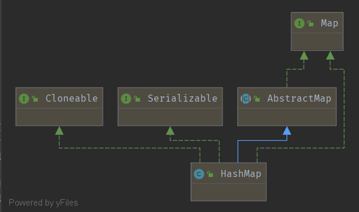

学习笔记
=======

## HashMap分析

### 继承分析

实现了Map接口, 实现逻辑基于哈希表。它允许接受null的键值，是非同步的。



### 数据结构

- 使用数组存储哈希表, 每个下标对应一个`Hash Bucket`。

```java
    /**
     * The table, initialized on first use, and resized as
     * necessary. When allocated, length is always a power of two.
     * (We also tolerate length zero in some operations to allow
     * bootstrapping mechanics that are currently not needed.)
     */
    transient Node<K,V>[] table;
```

- `Node`时一个静态内部类用于存储元素，并实现元素键值队。

```java
 static class Node<K,V> implements Map.Entry<K,V> {
        final int hash;
        final K key;
        V value;
        // 指针
        Node<K,V> next;

        Node(int hash, K key, V value, Node<K,V> next) {
            this.hash = hash;
            this.key = key;
            this.value = value;
            this.next = next;
        }

        public final V setValue(V newValue) {
           V oldValue = value;
            value = newValue;
            return oldValue;
        }
 }
 ```
  其中`key`时final对象，不可修改.

- 其中`table`中存储结构为链表或红黑树, 在后文展开说明。


### 初始化与扩容

主要由两个参数决定`initial capacity`和`load factor`

其中`initial capacity`是初始化时hash slot的数量。
`load factor`则时允许hash slot被使用的最大比例，默认为`0.75f`。

即当已经使用`slot`数量大于`capacity * loadFactor`时，将发生`resize()`操作。

可以适当调大`load factor`，减少扩容频率。

### 链表 还是 红黑树

上文提及每个Bucket中，存在单链表和红黑树两种结构。

当`table`容量大于`MIN_TREEIFY_CAPACITY`时, HashMap允许将Buckets中存储结果在树和单链表做转换。

当节点数量大于`TREEIFY_THRESHOLD`时，将单链表转换为树。
当节点数量小于`UNTREEIFY_THRESHOLD`时，将树退化为单链表。

```java
    /**
     * The bin count threshold for using a tree rather than list for a
     * bin.  Bins are converted to trees when adding an element to a
     * bin with at least this many nodes. The value must be greater
     * than 2 and should be at least 8 to mesh with assumptions in
     * tree removal about conversion back to plain bins upon
     * shrinkage.
     */
    static final int TREEIFY_THRESHOLD = 8;

    /**
     * The bin count threshold for untreeifying a (split) bin during a
     * resize operation. Should be less than TREEIFY_THRESHOLD, and at
     * most 6 to mesh with shrinkage detection under removal.
     */
    static final int UNTREEIFY_THRESHOLD = 6;

    /**
     * The smallest table capacity for which bins may be treeified.
     * (Otherwise the table is resized if too many nodes in a bin.)
     * Should be at least 4 * TREEIFY_THRESHOLD to avoid conflicts
     * between resizing and treeification thresholds.
     */
    static final int MIN_TREEIFY_CAPACITY = 64
   ```

### put方法

`put`方法用于插入数据, 主要逻辑由`putVal`方法实现，主要包含如下步骤:
1. 判断`table`是否被初始化，若否则执行resize()初始化table
2. 计算hash(key)对应的下标
3. 判断是否产生hash冲突，若未冲突则直接创建新节点并插入
4. 否则判断Node的数据结构，如果是头元素则直接更新，如果树则调用TreeNode的put方法, 否则当作链表插入
5. 4中使用树或链表是都需要统计元素数量，如果符合条件则会进行Treeify或Untreeify操作

```java
/**
     * Associates the specified value with the specified key in this map.
     * If the map previously contained a mapping for the key, the old
     * value is replaced.
     *
     * @param key key with which the specified value is to be associated
     * @param value value to be associated with the specified key
     * @return the previous value associated with {@code key}, or
     *         {@code null} if there was no mapping for {@code key}.
     *         (A {@code null} return can also indicate that the map
     *         previously associated {@code null} with {@code key}.)
     */
    public V put(K key, V value) {
        return putVal(hash(key), key, value, false, true);
    }

    /**
     * Implements Map.put and related methods.
     *
     * @param hash hash for key
     * @param key the key
     * @param value the value to put
     * @param onlyIfAbsent if true, don't change existing value
     * @param evict if false, the table is in creation mode.
     * @return previous value, or null if none
     */
    final V putVal(int hash, K key, V value, boolean onlyIfAbsent,
                   boolean evict) {
        Node<K,V>[] tab; Node<K,V> p; int n, i;
        // 未初始化, 则先初始化
        if ((tab = table) == null || (n = tab.length) == 0)
            n = (tab = resize()).length;
        // 根据hash(key) 计算table index
        if ((p = tab[i = (n - 1) & hash]) == null)
        // 如果对应下标hash未碰撞,则直接创建Node并插入table
            tab[i] = newNode(hash, key, value, null);
        else {
        // 发生碰撞
            // e用来存储key相通的Node的地址，即key已经存在，仅需要更新value
            Node<K,V> e; K k;
            // e在table中
            if (p.hash == hash &&
                ((k = p.key) == key || (key != null && key.equals(k))))
                e = p;
            // p.key != key ,且p是红黑树, 则调用TreeNode的插入方法
            else if (p instanceof TreeNode)
                e = ((TreeNode<K,V>)p).putTreeVal(this, tab, hash, key, value);
            // p是普通的单链表Node, 则遍历累计链表长度，并判断是否需要treeify
            else {
              // 遍历并插入数据, 因为最大长度是8，所以统计长度, 对效率影响不大
                for (int binCount = 0; ; ++binCount) {
                    if ((e = p.next) == null) {
                        p.next = newNode(hash, key, value, null);
                        if (binCount >= TREEIFY_THRESHOLD - 1) // -1 for 1st
                            treeifyBin(tab, hash);
                        break;
                    }
                    // 如果key已存在则break, key存在时链表长度不变, 不会触发treeify
                    if (e.hash == hash &&
                        ((k = e.key) == key || (key != null && key.equals(k))))
                        break;
                    p = e;
                }
            }
            // 如果 e 存在 则更新value
            if (e != null) { // existing mapping for key
                V oldValue = e.value;
                if (!onlyIfAbsent || oldValue == null)
                    e.value = value;
                afterNodeAccess(e);
                return oldValue;
            }
        }
        // 增加size
        ++modCount;
        if (++size > threshold)
            // 如果大于阈值则扩容
            resize();

        // 用于linkedHashMap重写
        afterNodeInsertion(evict);
        return null;
    }
```


### getValue

获取元素的方法`containsKey()`,`get()`都调用本方法
逻辑比较简单
1. 先查找对应下标的头节点 O(1)
2. 如果头节点存在，且不为所查询key
  + 是TreeNode, 时间复杂度O(logn)
  + 是链表，时间复杂度O(n), 因为最大长度固定，可以当作是常量

```java
    /**
     * Implements Map.get and related methods.
     *
     * @param hash hash for key
     * @param key the key
     * @return the node, or null if none
     */
    final Node<K,V> getNode(int hash, Object key) {
        Node<K,V>[] tab; Node<K,V> first, e; int n; K k;
        if ((tab = table) != null && (n = tab.length) > 0 &&
        // 根据hash(key)找到hash slot
            (first = tab[(n - 1) & hash]) != null) {
            if (first.hash == hash && // always check first node
                ((k = first.key) == key || (key != null && key.equals(k))))
                return first;
            if ((e = first.next) != null) {
                // 如果是treeNode，则调用TreeNode的get方法查找
                if (first instanceof TreeNode)
                    return ((TreeNode<K,V>)first).getTreeNode(hash, key);
                // 如果是单链表则轮询查找
                do {
                    if (e.hash == hash &&
                        ((k = e.key) == key || (key != null && key.equals(k))))
                        return e;
                } while ((e = e.next) != null);
            }
        }
        return null;
```

### resize

用于`table`的初始化和扩容。扩容条件见`load factor`说明。

resize时，如果没到最大上限，则扩容一倍,即 n << 1
需要进行rehash

rehash时判断 `( new_n - 1 ) & hash`的最高位时`0`还是`1`。(因为固定扩容一倍， 所以n每次多一位)
如果等于`0`则说明不需要移动，如果等于`1`则新slot下标等于`old_index + old_capacity`


```java
   /**
     * Initializes or doubles table size.  If null, allocates in
     * accord with initial capacity target held in field threshold.
     * Otherwise, because we are using power-of-two expansion, the
     * elements from each bin must either stay at same index, or move
     * with a power of two offset in the new table.
     *
     * @return the table
     */
    final Node<K,V>[] resize() {
        Node<K,V>[] oldTab = table;
        int oldCap = (oldTab == null) ? 0 : oldTab.length;
        int oldThr = threshold;
        int newCap, newThr = 0;
        // ----  数组扩容 ----
        if (oldCap > 0) {
            if (oldCap >= MAXIMUM_CAPACITY) {
                threshold = Integer.MAX_VALUE;
                return oldTab;
            }
            else if ((newCap = oldCap << 1) < MAXIMUM_CAPACITY &&
                     oldCap >= DEFAULT_INITIAL_CAPACITY)
                newThr = oldThr << 1; // double threshold
        }
        else if (oldThr > 0) // initial capacity was placed in threshold
            newCap = oldThr;
        else {               // zero initial threshold signifies using defaults
            newCap = DEFAULT_INITIAL_CAPACITY;
            newThr = (int)(DEFAULT_LOAD_FACTOR * DEFAULT_INITIAL_CAPACITY);
        }
        if (newThr == 0) {
            float ft = (float)newCap * loadFactor;
            newThr = (newCap < MAXIMUM_CAPACITY && ft < (float)MAXIMUM_CAPACITY ?
                      (int)ft : Integer.MAX_VALUE);
        }
        threshold = newThr;
        @SuppressWarnings({"rawtypes","unchecked"})
        Node<K,V>[] newTab = (Node<K,V>[])new Node[newCap];
        table = newTab;
        // ****** 开始移动元素 ********
        if (oldTab != null) {
            for (int j = 0; j < oldCap; ++j) {
                Node<K,V> e;
                // 如果原来的slot有数据
                if ((e = oldTab[j]) != null) {
                    oldTab[j] = null;
                    if (e.next == null)
                    // 计算新的slot下标
                        newTab[e.hash & (newCap - 1)] = e;
                    else if (e instanceof TreeNode)
                        ((TreeNode<K,V>)e).split(this, newTab, j, oldCap);
                    else { // preserve order
                        Node<K,V> loHead = null, loTail = null;
                        Node<K,V> hiHead = null, hiTail = null;
                        Node<K,V> next;
                        do {
                            next = e.next;
                            //  如果 oldCap - 32间bit全为0，则说明使用原索引
                            if ((e.hash & oldCap) == 0) {
                                if (loTail == null)
                                    loHead = e;
                                else
                                    loTail.next = e;
                                loTail = e;
                            }
                            // 使用高位的索引
                            else {
                                if (hiTail == null)
                                    hiHead = e;
                                else
                                    hiTail.next = e;
                                hiTail = e;
                            }
                        } while ((e = next) != null);
                        // 处理低位元素
                        if (loTail != null) {
                            loTail.next = null;
                            newTab[j] = loHead;
                        }
                        // 处理高位元素
                        if (hiTail != null) {
                            hiTail.next = null;
                            newTab[j + oldCap] = hiHead;
                        }
                    }
                }
            }
        }
        return newTab;
    }
```

### hash

用于计算`key`的hash值

HashMap没有直接使用key的hashcode, 而是使用hashcode的高16位和低16位作异或的方式。

因为计算slot下标时，HashMap采用`(n - 1) & hash`。

若当n远小于hash时, 直接采用key的hashcode, 实际计算只会参考`n - 1`位的值，会发生大量hash碰撞。

因此通过收集hashcode高16位与低16位的特征信息计算新的hashcode，可以有效的规避上述措施。

```java
    /**
     * Computes key.hashCode() and spreads (XORs) higher bits of hash
     * to lower.  Because the table uses power-of-two masking, sets of
     * hashes that vary only in bits above the current mask will
     * always collide. (Among known examples are sets of Float keys
     * holding consecutive whole numbers in small tables.)  So we
     * apply a transform that spreads the impact of higher bits
     * downward. There is a tradeoff between speed, utility, and
     * quality of bit-spreading. Because many common sets of hashes
     * are already reasonably distributed (so don't benefit from
     * spreading), and because we use trees to handle large sets of
     * collisions in bins, we just XOR some shifted bits in the
     * cheapest possible way to reduce systematic lossage, as well as
     * to incorporate impact of the highest bits that would otherwise
     * never be used in index calculations because of table bounds.
     */
    static final int hash(Object key) {
        int h;
        return (key == null) ? 0 : (h = key.hashCode()) ^ (h >>> 16);
```